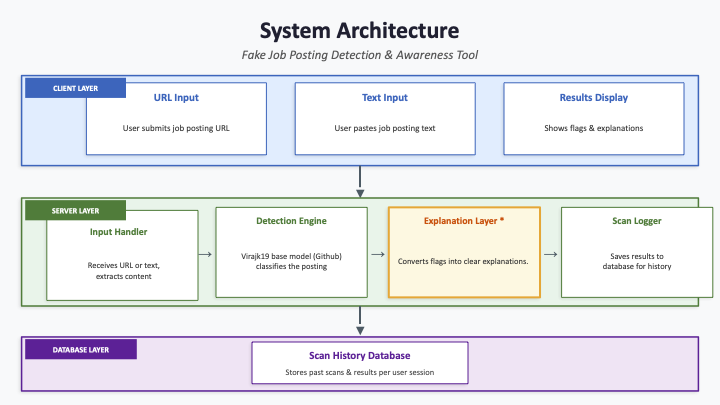
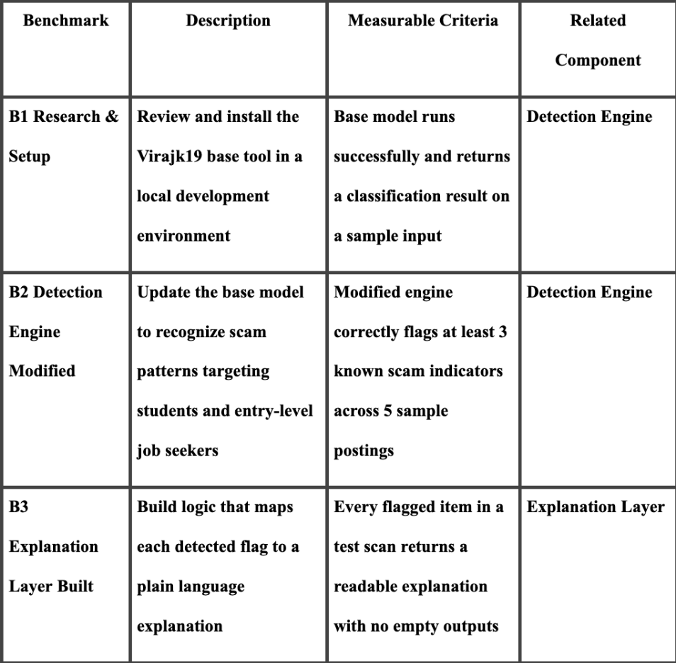
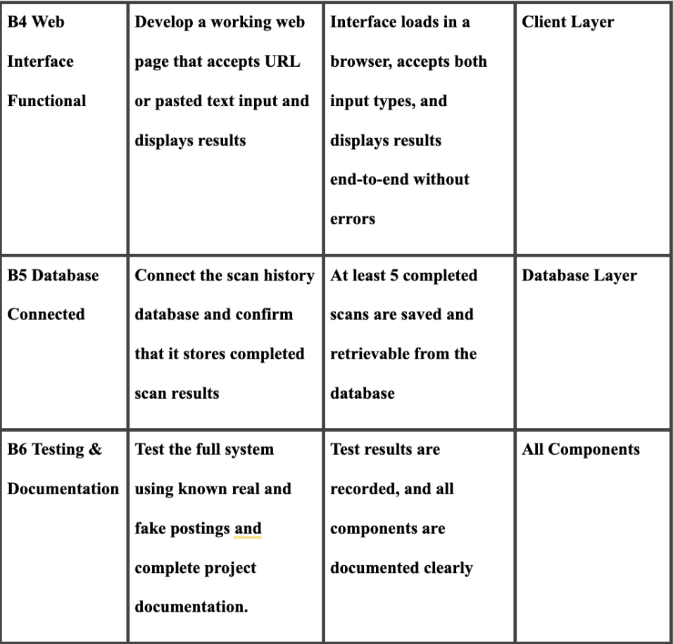
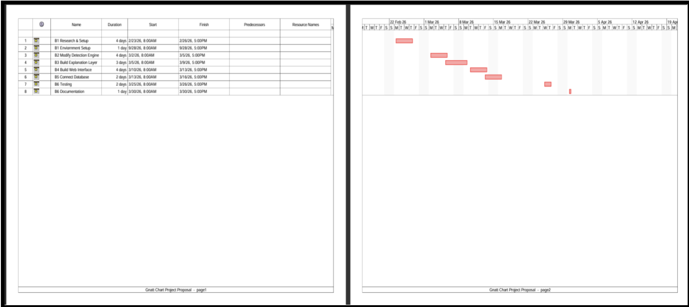

CYB 4800

Senior Capstone Project
Spring 2026

Project Proposal
for 

Design and Development of Fake Job Posting Detection Tool
Jynalis Diaz

Faculty Instructor
Dr. Sagar Raina

Table of Contents 
3.2 Objectives	3
3.3 Problem Specification	4
3.4 Solution Design	6
3.5 Benchmark Specifications	8
3.6 Tools List	9
3.7 Time Schedule	12

3.2 Objectives
The main objective of this project is to improve an existing fraudulent job posting detection program so that students seeking internships and remote employment can identify them more easily. 
The updated program not only classifies posts as legitimate or fake, but also identifies and explains warning flags, making it both a detector and an instructional tool. 
To do this, researchers will examine common scam traits such as confusing job descriptions, early demands for personal information, unverified employer data, and unusual contact techniques. 
On top of the present detection engine, these indicators will be used to develop an explanation layer that communicates results in a way that students can genuinely understand and learn from.
The ultimate objective is to teach students how to spot suspicious postings on their own over time, rather than relying solely on a program to provide an answer. 
Through this project, I hope to improve my abilities in altering existing systems, working with text analysis, and completing an entire project lifecycle, from research and design to implementation, testing, and documentation.	

3.3 Problem Specification 
Many students searching for jobs and internships, especially remote positions, come across fake job postings. 
These postings are created by scammers pretending to be real employers to collect personal information such as email addresses, phone numbers, and resumes. 
Once shared, this information can be misused or lead to identity theft.
Fake job postings can look very convincing and may appear on popular job platforms, but they often contain warning signs. 
These can include vague job descriptions, early requests for personal information, missing company details, or unusual contact methods, such as WhatsApp messages. 
Students may not always recognize these signs, especially when eager to secure a job. As a student myself, I have experienced this difficulty firsthand, which motivated this project.
Various approaches have been used to address this issue. Pillai (2023) proposed a high-accuracy Bidirectional LSTM model for detecting fraudulent job advertising by analyzing textual and numerical characteristics in job listing data. 
Community-developed technologies, such as the fake Job Detector projects on GitHub and Devpost, allow anyone to post job vacancies and receive a true or false classification. 
Despite demonstrating that automated detection is possible, all of these devices have the same disadvantage: they offer a shallow result without context. 
They decide without explaining whether certain features of the advertisement are dubious or why they are viewed as red flags.
The purpose of this project is to create a system that not only helps students identify potentially fake or risky job postings before they apply, but also explains the reasoning behind each flag in plain language. 
Rather than returning a simple verdict, the tool will highlight specific warning signs found within a posting and provide a brief explanation of why each one is considered suspicious. 
This approach treats the user as someone who needs to learn, not just someone who needs an answer.
The system will not guarantee that a job is fake, but it will provide meaningful guidance and actively increase a student's ability to recognize risk on their own. 
Overall, this project aims to help students protect their personal information and feel more confident and informed when applying for jobs online.

3.4 Solution Design 
 
 
 
The system is built across three layers that work together to analyze a job posting and return results to the user, as shown in the diagram above.
Client Layer
This is the part of the tool that users see and interact with. When a student visits the website, they can either paste the text of a job posting directly into the tool or submit a link to the posting. 
Once the system finishes analyzing it, the results are shown back to the student on the same page, including any warning signs found and a simple explanation for each.
Server Layer
This is the system's behind-the-scenes part, where all the analysis happens. It has four parts. First, the Input Handler receives whatever the student submitted and gets it ready to be analyzed. 
Next, the Detection Engine, which is built on a modified version of an existing tool called Virajk19, reads through the job posting and looks for patterns that are commonly found in fake or suspicious listings. 
After that, the Explanation Layer takes each warning sign that was found and turns it into a short, easy-to-read explanation so the student understands not just that something was flagged, but why it is a concern and what to watch out for.
Finally, the Scan Logger saves the results so they can be stored and referenced later.
Database Layer
This is where the system stores a record of each scan that has been completed. Saving this information allows users to look back at postings they have previously checked.

3.5 Benchmark Specifications

3.6 Tools List

1. GitHub
GitHub will be used for version control and project management. 
It will allow me to track changes to my code, back up my work, and document progress throughout the development process.
2. Kali Linux 
Primary OS used for the development of the project.
3. Python
Python will be used to build the backend of the system, including the input handler, detection engine, explanation layer, and scan logger. 
Python was chosen because it is beginner-friendly.
4. Flask
Flask is a lightweight Python framework that will be used to connect the backend logic to the web interface. 
It allows Python code to run behind a website and handle user submissions without requiring advanced web development knowledge. 
5. HTML
HTML will be used to create the structure of the website, including the input fields where users can submit a job posting and the area where results are displayed.
6. CSS
CSS will be used to design and format the website, improving the visual layout and making the tool easier to use.
7. SQLite
SQLite is a simple database tool that will be used to store scan history. It works directly with Python and does not require a separate database server to set up, making it ideal for this project.
8. Kaggle (EMSCAD Dataset)
The Employment Scam Aegean Dataset on Kaggle will serve as the primary data source for testing the detection engine. 
It contains thousands of real and fake job postings that can be used to evaluate how well the system identifies suspicious listings.
9. Text Editor
Basic Text Editor used to write, edit, and manage project files, including Python scripts and documentation, with the Kali Environment. 
10. Claude AI
An AI assistant to help with troubleshooting issues and problem-solving during the project. 

3.7 Time Schedule

